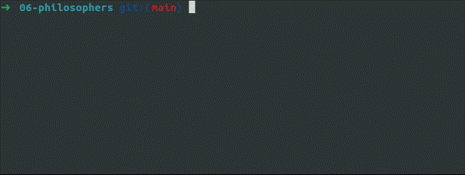

# The Dining Philosophers Problem

## Description

The `Philosophers` project simulates the *dining philosophers problem*, a classic synchronization problem involving philosophers who alternately think, eat, and sleep. Each philosopher must pick up two forks (mutexes) to eat, and this project implements a solution that avoids deadlock and starvation.

## Features

- Simulates the philosopher problem with configurable numbers of philosophers and time constraints.
- Avoids deadlock through careful synchronization of fork usage (mutexes).
- Dynamic allocation of philosophers and forks, ensuring memory efficiency.
- Real-time status updates on philosopher actions (eating, thinking, and sleeping) and termination conditions.

## Compilation and Usage

### Compilation

To compile the project, run the following command in the root directory:
```bash
make
```

This will generate the `philo` executable.



### Usage

The program expects the following arguments:
```bash
./philo [number_of_philosophers] [time_to_die] [time_to_eat] [time_to_sleep] [number_of_times_each_philosopher_must_eat (optional)]
```

- `number_of_philosophers`: Number of philosophers (and forks).
- `time_to_die`: Time (in milliseconds) a philosopher can go without eating before dying.
- `time_to_eat`: Time (in milliseconds) a philosopher spends eating.
- `time_to_sleep`: Time (in milliseconds) a philosopher spends sleeping.
- `number_of_times_each_philosopher_must_eat` (optional): Number of times each philosopher must eat before the simulation ends. If not specified, philosophers eat indefinitely.

Example usage:
```bash
./philo 5 800 200 200 2
```


This command runs a simulation with 5 philosophers, where each has 800 milliseconds to eat before dying, spends 200 milliseconds eating and 200 milliseconds sleeping, and must eat 2 times before the simulation ends.

## Project Structure
```css
.
├── Makefile
├── main.c
├── philosophers.h
├── args/
│   ├── args.c
│   ├── checks.c
│   └── init.c
├── routine/
│   └── routine.c
├── utils/
│   ├── print.c
│   ├── terminate.c
│   └── time.c
├── minilib/
    ├── ft_atoi.c
    ├── ft_isdigit.c
    ├── ft_isspace.c
    ├── ft_putchar_fd.c
    └── ft_putstr_fd.c
```

- `args/`: Functions to parse and check command-line arguments.
- `routine/`: The core routines of the philosophers' actions (eating, sleeping, thinking).
- `utils/`: Helper functions for time management, message printing, and termination.
- `minilib/`: Custom implementations of common standard library functions.

## How to Use

After compiling and running the program with your chosen parameters, you will see real-time status messages indicating when each philosopher is eating, thinking, sleeping, and when they die (if applicable). The program terminates when all philosophers have eaten the specified number of times or if any philosopher dies.

#### Extra example:

```bash
./philo 5 800 200 200 5
```


#### Extra example:

```bash
./philo 5 800 300 300 2
```


## Author

Project developed by [Emin A.](https://github.com/emayia) as part of the École 42 curriculum.
